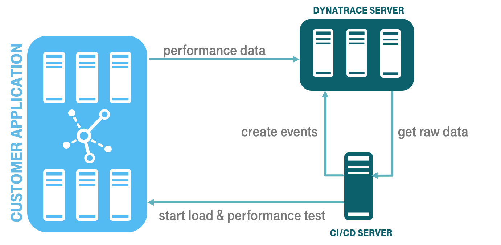
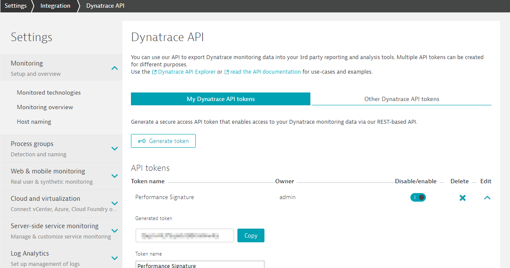
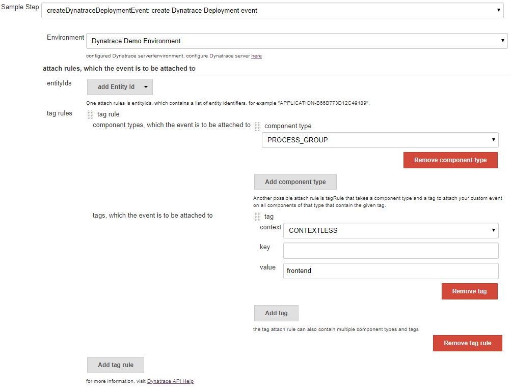
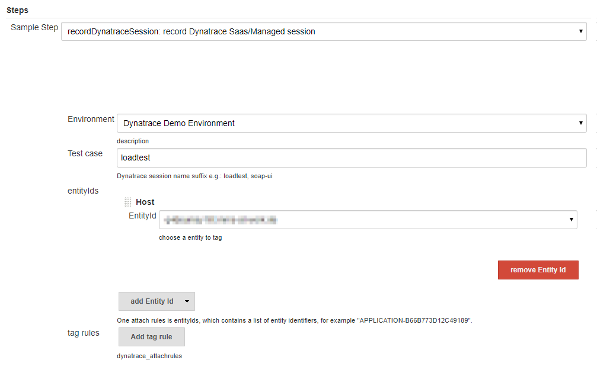
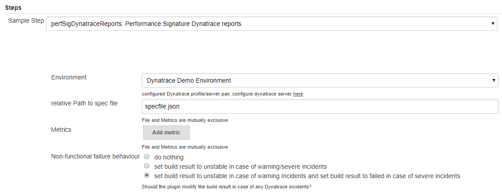

## Performance Signature: Dynatrace SaaS/Managed

### Features

* Implements continuous performance measurements during load tests with possibility to utilize the full power of Dynatrace (monitoring, analyze problems & root causes)
* Dynatrace is one of the leading APM tools (Gartner)
* Perfect integration into automated CI/CD pipelines 
* Performance Signature extends Dynatrace by evaluating load tests



### Installation
#### Using Jenkins Update Center 

The recommended way of installing the plugin is by the Update Center (plugin directory). Navigate to `Manage Jenkins -> Manage Plugins` page and switch to the `Available` tab. Search for the "Dynatrace" keyword and install the plugin.

#### Manual Installation

This procedure is meant for developers who want to install locally built plugin version.

* build the plugin from source using `mvn package` command
* in Jenkins, go to `Manage Jenkins -> Manage Plugins` page
* switch to the `Advanced` tab
* upload the built plugin package from `target/performance-signature-dynatracesaas.hpi` path in the `Upload Plugin` section
* restart Jenkins when the installation is complete

### Configuration
#### Global settings

A Dynatrace API Token is needed for access to the Dynatrace API REST Interface. To create a Dynatrace API Token go to `Settings -> Integration -> Dynatrace API` in your Environment and generate a Token with the following access scopes:
* Access problem and event feed, metrics, topology and RUM JavaScript tag management
* User session query language



The global settings for the plugin are located under `Manage Jenkins -> Configure System -> Performance Signature: Dynatrace`. The connection to the Dynatrace Server is configured in this section. 


The advanced section enables you to set a delay before retrieving the test results from the server. Change this settings if you are not getting all the test results in Jenkins.

#### Step configuration

The **`createDynatraceDeploymentEvent`** pipeline step creates a deployment event in Dynatrace.
The set of rules defining Dynatrace entities to be associated with the event. You can specify tags to dynamically match Dynatrace entities or IDs of specific entities. At least one entity ID or tag is required.



The following code shows an example configuration:
```groovy
createDynatraceDeploymentEvent(
        envId: 'Dynatrace Demo Environment', 
        tagMatchRules: [
            [
                meTypes: [
                        [meType: 'PROCESS_GROUP']
                ],
                tags: [
                        [context: 'CONTEXTLESS', key: '', value: 'frontend']
                ]
            ]
        ]) {
    // some block
}
```

The **`recordDynatraceSession`** pipeline step creates a custom info event, which contains some useful information about the build context.
The step is needed in order to track the start and end timestamps of the actual loadtest.



The following code shows an example configuration:
```groovy
recordDynatraceSession(
        envId: 'Dynatrace Demo Environment',
        testCase: 'loadtest',
        tagMatchRules: [
            [
                meTypes: [[meType: 'PROCESS_GROUP']],
                tags: [
                        [context: 'CONTEXTLESS', key: '', value: 'frontend']
                ]
            ]
        ]) {
    // some block
}
```

The **`perfSigDynatraceReports`** pipeline step queries all metrics from the configured Dynatrace instance.
The user can choose between manual added metrics from the metric browser or a so called Specfile.
The Specfile format can be found [here](#spec-file-format).



The following code shows an example configuration:
```groovy
perfSigDynatraceReports envId: 'Dynatrace Demo Environment', nonFunctionalFailure: 2, specFile: 'specfile.json'
```

### Spec file format

The Spec file contains two parts, the global configuration and the timeseries configuration.
Within the global configuration the user can set a global lower and also a upper bound.
Wihtin the timeseries configuration, the user can specify: 
* the timeseriesId (all available timeseriesIds can be found [here](https://www.dynatrace.com/support/help/dynatrace-api/timeseries/how-do-i-fetch-the-metrics-of-monitored-entities/#available-metrics-)),
* the aggregation of the metric (all available aggregations can be found [here](https://www.dynatrace.com/support/help/shortlink/api-metrics#aggregation-types))
* tags, which should be used for the selection over all entityIds
* entityIds
* a lower and upper bound for this metric

```json
{
  "lowerBound": 1,
  "upperBound": 4,
  "_comment": "global configuration environment-wide",
  "timeseries": [
    {
      "timeseriesId": "com.dynatrace.builtin:service.responsetime",
      "aggregation": "avg",
      "tags": "Frontend",
      "lowerBound": 250000,
      "upperBound": 1000000
    },
    {
      "timeseriesId": "com.dynatrace.builtin:service.responsetime",
      "aggregation": "avg",
      "entityIds": "SERVICE-65778F58A66834D8",
      "lowerBound": 4000000,
      "upperBound": 8000000
    },
    {
      "timeseriesId": "com.dynatrace.builtin:docker.container.cpu",
      "aggregation": "avg",
      "lowerBound": 50,
      "upperBound": 70
    }
  ]
}
```

### Dynatrace Events

The plugin creates two events, a Deployment event with the createDeployment 


### Examples

```groovy
timestamps {
    node {
        catchError {
            stage('deploy on staging') {
                createDynatraceDeploymentEvent(envId: 'Dynatrace Demo Environment', tagMatchRules: [[meTypes: [[meType: 'SERVICE']], tags: [[context: 'CONTEXTLESS', key: 'Frontend']]], [meTypes: [[meType: 'SERVICE']], tags: [[context: 'CONTEXTLESS', key: 'Database']]]]) {
                    sh 'docker-compose down'
                    sh 'docker-compose up -d'
                }
            }
            stage('performance test') {
                recordDynatraceSession(envId: 'Dynatrace Demo Environment', testCase: 'loadtest', tagMatchRules: [[meTypes: [[meType: 'SERVICE']], tags: [[context: 'CONTEXTLESS', key: 'Frontend']]], [meTypes: [[meType: 'SERVICE']], tags: [[context: 'CONTEXTLESS', key: 'Database']]]]) {
                    performanceTest(readFile('performanceTest.json')) //this is not part of this plugin
                }
            }
            stage('reporting') {
                perfSigDynatraceReports envId: 'Dynatrace Demo Environment', specFile: 'specfile.json', nonFunctionalFailure: 2
            }
        }
        step([$class: 'Mailer', notifyEveryUnstableBuild: false, recipients: 'build@notify.me', sendToIndividuals: false])
    }
}
